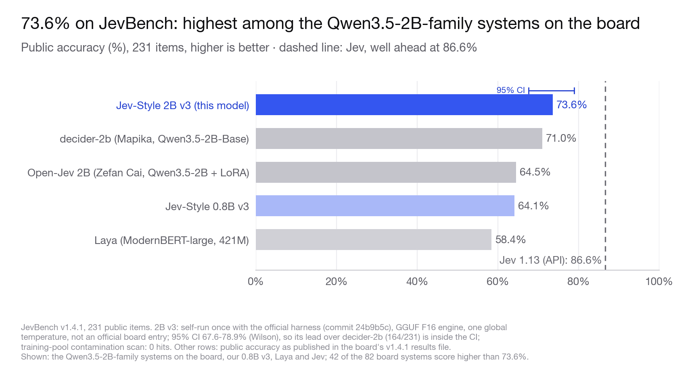
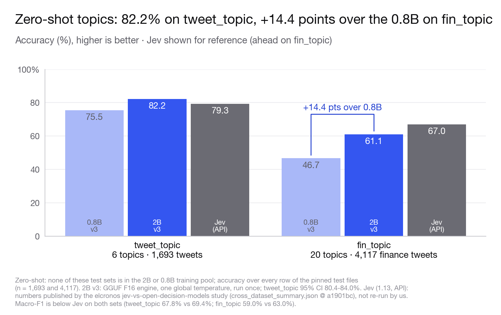

# Jev-Style-2B-Decision-v3

**[Try it in your browser →](https://huggingface.co/spaces/chaoliangUNSW/jev-style-2b)**

**Website:** [jevstyle.com](https://jevstyle.com/#v3-2b) · **GitHub:** [jev-style](https://github.com/lawrence3699/jev-style) · **Collection:** [all v3 builds and demos](https://huggingface.co/collections/chaoliangUNSW/jev-style-decision-v3-08b-2b-6ab87f32380cbd8c03b608b9)

**Jev-Style decision series:** [v1 · 2B](https://huggingface.co/chaoliangUNSW/Jev-Style-Qwen3.5-2B-Decision-GGUF) → [v2 · 2B](https://huggingface.co/chaoliangUNSW/Jev-Style-Qwen3.5-2B-Decision-v2) → [v3 · 0.8B](https://huggingface.co/chaoliangUNSW/Jev-Style-0.8B-Decision-v3) → **v3 · 2B (this model)**

<!-- PIP_SNIPPET (jev-style 0.3.0, added 2026-09-27) -->
**Quickest start: the [jev-style](https://github.com/lawrence3699/jev-style) package** (0.3.0 or later) downloads this
model and serves a local `/v1/systemone` API (its default release is the 0.8B, so pass `--release 2b`):

```bash
pip install "jev-style[torch]"     # or "jev-style[mlx]" on Apple silicon (use the -MLX build there)
jev-style serve --release 2b       # http://127.0.0.1:8765
```

```python
from jev_style import JevStyle, choice, noul

js = JevStyle.from_pretrained("chaoliangUNSW/Jev-Style-2B-Decision-v3")   # PyTorch; -MLX / -GGUF repo ids pick those builds
out = js.decide("I was charged twice. Please fix this ASAP.", {
    "billing": noul("This ticket is about billing."),
    "tone": choice("What is the customer's tone?", ["calm", "frustrated", "angry"]),
})
print(out["answers"]["billing"]["noul"], out["answers"]["tone"]["choice"])
```

PyTorch on a CPU is slow for the 2B; on a Mac use the MLX build, elsewhere a GPU or the GGUF build.

**Jev-style decisions, now at 2B.** Give it a state and typed questions; it returns a calibrated probability for
every option in one pass. 1.88B parameters (text-only Qwen3.5-2B), open weights, Apache-2.0.


| Public benchmark | **Jev-Style v3 · 2B** | Jev-Style v3 · 0.8B | Jev 1.13 (API) |
|---|:---:|:---:|:---:|
| JevBench v1.4.1, 231 public items ↑ | 73.6% | 64.1% | 86.6% |
| tweet_topic, zero-shot, accuracy ↑ | 82.2% | 75.5% | 79.3%¹ |
| fin_topic, zero-shot, accuracy ↑ | 61.1% | 46.7% | 67.0%¹ |
| Longest input per call | 25,600 tokens, no option cap | 25,600 tokens | |

<sub>2B v3: GGUF F16 engine, one global temperature, each benchmark run once as pre-declared. JevBench: self-run with the official harness, not an official board entry; 95% CI 67.6–78.9% (Wilson). Jev is well ahead of the 2B on JevBench and ahead on fin_topic. ¹ Jev numbers from the elcronos study (raw API), not re-run by us. On tweet_topic the 2B's macro-F1 (67.8%) is below Jev's (69.4%). Details: [Results](#results).</sub>

**73.6% on JevBench.** On the 231 public items of JevBench v1.4.1 this is the highest JevBench public accuracy
among the Qwen3.5-2B-family systems on the v1.4.1 board (decider-2b 71.0%, open-jev-zefan-2b 64.5%), and
+9.5 points over our 0.8B v3. The 95% CI (67.6–78.9%) includes decider-2b's 71.0%, so that lead is a point
estimate. Jev (86.6%) is well ahead.

**25,600 tokens, no option cap.** State, questions and every option share one 25,600-token budget. There is no
separate question/options limit: when the question and its options exceed 2,048 tokens, the runtime switches to a
numbered-option catalogue. Nothing is ever truncated; an input over budget raises `InputBudgetError`.

## What it does

A state (text or JSON) and a typed question go in; a probability for every option comes out. The model never
generates text and cannot answer outside the options it is given.

- **choice**: pick one of N named options;
- **noul** (yes/no): the probability that a statement about the state is true;
- **score**: a distribution over 2 to 10 ordered levels.

One example, run with this repository's runtime (`jev_style_decision.py`) on the released weights, CPU, float32:

```python
from jev_style_decision import JevStyleDecision

m = JevStyleDecision(".", device="cpu", threads=4)
r = m.decide({"ticket": "I was charged twice for my subscription this month.", "customer_tier": "pro"},
             "Which team should handle this ticket?",
             options={"billing": "payments, invoices, refunds", "technical": "bugs and outages", "sales": "new purchases"})
print(r["answer"], r["probabilities"])
# billing  {'billing': 0.976, 'technical': 0.007, 'sales': 0.017}   (rounded)
```

Several questions about one state are scored in one call; the state is computed once and reused:

```python
state = "Order #1182: paid, packed, handed to the courier on Monday. Tracking shows 'delivered' on Wednesday."
m.decide_many(state, [
    {"t": "noul", "ins": "Has the order been delivered?", "crit": None},
    {"t": "choice", "ins": "Which step is the order at?", "crit": {"packing": None, "in transit": None, "delivered": None}},
    {"t": "score", "ins": "How urgent is a follow-up?", "crit": ["not urgent", "somewhat urgent", "urgent", "critical"]},
])
# -> true 0.976 · delivered 0.686 (in transit 0.294) · level "1" 0.439 (level "0" 0.412)   (rounded)
```

## Quick start

```bash
pip install -U huggingface_hub
hf download chaoliangUNSW/Jev-Style-2B-Decision-v3 --local-dir jev-v3-2b && cd jev-v3-2b
pip install -r requirements.txt          # torch 2.14.0, transformers 5.17.0, tokenizers 0.23.2, numpy 2.5.3

python jev_style_decision.py --model-dir . --device cpu --threads 4 \
  --state "The user asked to cancel the order" \
  --question "What should happen?" \
  --options '{"cancel": "cancel the order", "ship": "ship it"}'
# -> "answer": "cancel", probability 0.993 (CPU, float32)
```

`decide` returns `answer`, `probabilities`, the raw `scores`, the `temperature` used, `top_probability`,
`entropy_concentration`, token counts (`input_tokens`, `state_tokens`, `head_tokens`), `blocks`,
`catalogue_overflow`, `model` and `backend`. Batch mode reads JSON lines (`--jsonl file|-`); consecutive rows with
the same state share one state computation. `--verify` first checks the weights, tokenizer, configs and runtime against the sha256
manifest (documentation and evaluation records — `README.md`, `figures/`, `validation/` and `eval_results.json` —
are listed there but not checked).
A true/false question returns `{"false": p, "true": p}`; a score question returns the level indices `"0"`,
`"1"`, ... as option names.

```bash
python jev_style_decision.py --model-dir . --device cpu --threads 4 --jsonl rows.jsonl
```

Devices (`--device`): CPU and Apple MPS were run for this card; CUDA is supported by the runtime but was not run
for this release. float32 is the default (the format checks below used float32 on CPU); `--dtype bfloat16` (CUDA
only) was not parity-checked. `category=` is accepted for compatibility with the 0.8B v3 runtime and ignored: this model has one
global temperature.

### Other builds

| Build | Size | Runtime |
|---|---:|---|
| **Transformers safetensors (bf16) · this repository** | 3.76 GB (2 shards) | PyTorch on CPU, Apple MPS or CUDA (`jev_style_decision.py`) |
| [GGUF F16 / Q8_0 / Q4_K_M](https://huggingface.co/chaoliangUNSW/Jev-Style-2B-Decision-v3-GGUF) | 3.78 / 2.01 / 1.27 GB | llama.cpp (libllama) + the bundled `jev-score-v2` scorer |
| [MLX bf16 / 8-bit](https://huggingface.co/chaoliangUNSW/Jev-Style-2B-Decision-v3-MLX) (one repository) | 3.76 / 2.00 GB | Apple silicon, mlx-lm 0.31.3 (`--model-dir bf16\|8bit`) |

## Which file to pick

Every format was checked against the PyTorch FP32 reference on the released checkpoint, with gates declared before
any format was scored. All five pass.

| Format | Size | Same top-1 as FP32 (1,000 rows) | Max abs Δp (1,000 rows) | Accuracy (FP32: 80.8%) | Long fixture (43 questions, up to 25,600 tokens) | Gate |
|---|---:|---:|---:|---:|---:|:---:|
| PyTorch (this repository) | 3.76 GB | reference | | 80.8% | reference | |
| GGUF F16 | 3.78 GB | 100% | 0.0014 | 80.8% | 43 / 43 | PASS |
| GGUF Q8_0 | 2.01 GB | 99.7% | 0.033 | 80.7% | 43 / 43 | PASS |
| GGUF Q4_K_M | 1.27 GB | 95.7% | 0.346 | 81.1% | 42 / 43 | PASS¹ |
| MLX bf16 | 3.76 GB | 99.7% | 0.035 | 80.5% | 43 / 43 | PASS |
| MLX 8-bit (affine, group 64) | 2.00 GB | 99.6% | 0.162 | 80.8% | 43 / 43 | PASS |

- **Long documents: use GGUF Q8_0 or F16.** Q4_K_M is noticeably noisier on long inputs.
- **Apple silicon:** MLX bf16 (3.76 GB) for closeness to FP32: its scores are the closer of the two MLX builds to the
  FP32 reference (max abs Δp 0.035 vs 0.162 for 8-bit). MLX 8-bit (2.00 GB) when memory is tight.
- **Smallest file:** GGUF Q4_K_M, 1.27 GB.

<sub>Reference: HF FP32 on CPU, exact block attention, on the released bf16 checkpoint. Gate fixture: 1,000 real development rows (≤4,096 tokens); these rows test agreement between formats. Long fixture: 35 requests / 43 questions up to 25,600 tokens, including catalogue-overflow questions and up to 151 options. ¹ For 4-bit the pre-declared gate is the accuracy drop (≤1.0 point); top-1 agreement is reported only. Sizes are the weight files (GB = 10^9 bytes); MLX adds a 0.42 MB FP32 norm file.</sub>

<!-- LATENCY:BEGIN generated from latency_2b.json (validation/latency_2b.json in the main repository); do not edit by hand -->

## Speed

**Read once, then ask.** On an Apple M1 Max (GGUF F16), the first question about a 24,501-token input took 16.2 s; a further question about the same state took 0.17 s, because the state is computed once and reused (medians). Ten questions about that state in one call took 16.8 s.

| State | Questions per call | GGUF F16 | MLX bf16 | PyTorch (MPS, float32) |
|---|---:|---:|---:|---:|
| 878 tokens | 1 | 0.52 s | 0.57 s | 1.82 s |
| 878 tokens | 10 | 0.97 s | 1.07 s | 3.13 s |
| 3,950 tokens | 1 | 2.18 s | 2.26 s | 7.74 s |
| 3,950 tokens | 10 | 2.66 s | 2.80 s | 9.23 s |
| 24,436 tokens | 1 | 16.2 s | 15.5 s | 61.9 s |
| 24,436 tokens | 10 | 16.8 s | 16.2 s | 72.3 s |
| 24,436 tokens, already computed | 1 | 0.17 s | 0.15 s | 0.60 s |

<sub>Apple M1 Max, 64 GB, macOS 15.7.5. Wall time around one `decide` / `score_many` call (tokenisation included), median of 3 calls with the state recomputed each time; the model was loaded beforehand (loading took 1.2–8.0 s here, not included). States: English documentation and source code of 878, 3,950, 24,436 tokens plus the question; 10 questions = 4 choice, 4 true/false and 2 score questions about the same state in one call; with the question and options each input was up to 943, 4,015 and 24,501 tokens. GGUF: `jev-score-v2` on llama.cpp 441df11f, Metal, all layers on the GPU. MLX: mlx 0.32.2 / mlx-lm 0.31.3. PyTorch: this repository's runtime, float32 on Apple MPS. Results were identical with and without a precomputed state. Other jobs shared the machine during these runs (1-minute load average 5.5–11.1 at the end of each run), so treat the numbers as indicative. The PyTorch rows were measured in an earlier session (2026-09-27 00:45–02:15 AEST, load average 7.3–11.1); the GGUF and MLX rows were re-measured later (03:11–03:24 AEST, load average 5.5–10.0) because other jobs had slowed the earlier session (the re-measured GGUF and MLX rows shown here were up to 2.1× faster), so the PyTorch times may be pessimistic.</sub>

<!-- LATENCY:END -->

### CUDA graphs: 6× faster short calls on CUDA

`JevStyleDecision(".", device="cuda", cuda_graphs=True)` (CLI `--cuda-graphs`; on by default on CUDA in [`jev-style`](https://github.com/lawrence3699/jev-style) 0.4.0 and later) records one CUDA graph per padded input length at start-up (about 11 s) and replays it. Same weights and readout: on 4,992 held-out calibration questions it picked the same answer as the ordinary path every time (largest probability difference 0.0024).

| RTX 5090, float32 | ordinary path | CUDA graphs |
|---|---:|---:|
| median | 86.2 ms | **13.9 ms** |
| mean | 122.8 ms | 53.6 ms |
| p95 | 286.7 ms | 283.3 ms |

<sub>One request at a time, warm, 1,000 requests sampled from a 3,758-request calibration set (4,992 questions, mostly up to 4K tokens, about a quarter non-English); wall time around `decide_many`. torch 2.14.1+cu130, transformers 5.18.0, flash-linear-attention 0.5.2. Inputs over 4,096 tokens, more than 256 options, or several questions about one long state (re-reading it would cost more than 2,048 state tokens) use the block path, which reads the state once.</sub>

## Results

All public benchmarks were pre-declared: GGUF F16 engine, each benchmark run once, one global temperature fitted
on our own calibration rows (never on benchmark items).

### JevBench v1.4.1: 73.6% on the public items



**73.6% (170 / 231)**, the highest JevBench public accuracy among the Qwen3.5-2B-family systems on the v1.4.1
board (decider-2b 71.0%, open-jev-zefan-2b 64.5%), and +9.5 points over the 0.8B v3. Jev (86.6%) is well ahead.

| System | Public accuracy (231) | Easy (48) | Standard (72) | Hard (111) | Hard-tier ECE |
|---|---:|---:|---:|---:|---:|
| **Jev-Style 2B v3** (this model, self-run) | 73.6% (170) | 100% | 95.8% | 47.7% | 0.153² |
| Jev-Style 0.8B v3 (self-run) | 64.1% (148) | 100% | 81.9% | 36.9% | 0.200² |
| Jev 1.13.0 (TypeSafe AI, API) | 86.6% | | | | |
| Decision 2B (FlyMy.AI, MiniCPM5-2B + LoRA, evaluation-only weights) | 75.3% | | | | |
| decider-2b (Mapika, Qwen3.5-2B-Base) | 71.0% | | | | |
| Raw Qwen3-4B-Instruct-2507 logits | 69.7% | | | | |
| kev 0.6B | 66.7% | | | | |
| Open-Jev 2B (Zefan Cai, Qwen3.5-2B + LoRA) | 64.5% | | | | |
| Laya (ModernBERT-large, 421M) | 58.4% | | | | |

<sub>JevBench v1.4.1 (github.com/fstandhartinger/jevbench, tag v1.4.1, commit 24b9b5c), public items only. 2B v3: self-run once with the vendored official harness, GGUF F16, zero-shot, one global temperature; 95% CI 67.6–78.9% (Wilson), which includes decider-2b (164 / 231), so that lead is a point estimate; not an official leaderboard entry. Other rows: public accuracy as published in the board's v1.4.1 results file; 42 of the 82 board systems score higher than 73.6%, almost all of them 4B or larger, or large API models. ² ECE over the 111 public hard items; the board's ECE uses all 220 hard items, so it is only an approximate comparison. Training-pool contamination scan (state hash, instruction hash, text fields of 32+ characters, 13-word spans): 0 hits.</sub>

### Zero-shot topics: 82.2% on tweet_topic



**On tweet_topic the 2B scores 82.2% accuracy, above Jev's 79.3%**, which lies outside the 2B's 95% CI
(80.4–84.0%). Its macro-F1 is below Jev's (67.8% vs 69.4%). **On the 20-way fin_topic it scores 61.1%, +14.4
points over the 0.8B v3**; Jev is higher there (67.0%).

| Set | n | **2B v3 accuracy** [95% CI] | 2B v3 macro-F1 | 2B v3 ECE (calibrated) | Jev accuracy / macro-F1 / ECE (raw API) | 0.8B v3 accuracy |
|---|---:|---:|---:|---:|---:|---:|
| tweet_topic | 1,693 | 82.2% [80.4, 84.0] | 67.8% | 0.028 | 79.3% / 69.4% / 0.063 | 75.5% |
| fin_topic | 4,117 | 61.1% [59.6, 62.6] | 59.0% | 0.065 | 67.0% / 63.0% / 0.166 | 46.7% |

<sub>Zero-shot: none of these test sets is in the training pool (0 exact overlaps, 0 near-duplicates). Accuracy over every row of the pinned test files; CIs are percentile bootstrap (10,000 resamples). Jev (1.13, API): numbers published by the [elcronos jev-vs-open-decision-models study](https://github.com/elcronos/jev-vs-open-decision-models) (results/cross_dataset_summary.json @ a1901bc), not re-run by us. ECE: 15 equal-width bins; ours uses the model's one global temperature (fitted on our own calibration rows, never on these sets), Jev's is from its raw API probabilities, so the two ECE columns are not like-for-like. The temperature is fitted once for all tasks, not per test set: without it (T = 1) the 2B's ECE is 0.087 on tweet_topic and 0.038 on fin_topic.</sub>

## How it differs from the 0.8B v3

Both v3 models read 25,600 tokens and score every option at its own verdict slot. The 2B is a separate full
fine-tune with a different input protocol, so each size needs its own runtime.

| | [Jev-Style 0.8B v3](https://huggingface.co/chaoliangUNSW/Jev-Style-0.8B-Decision-v3) | **Jev-Style 2B v3 (this model)** |
|---|---|---|
| Base | Qwen/Qwen3.5-0.8B | **Qwen/Qwen3.5-2B** (post-trained, not -Base) |
| Parameters | 752,393,024 | **1,881,825,088** (24 layers: 18 Gated DeltaNet + 6 full attention, hidden 2,048) |
| Input protocol | v1: causal attention | **v2: block attention**. Each 2,048-token block sees everything before it plus itself |
| Question/options limit | 2,048-token head; longer option lists are split into option chunks | **None**: one 25,600-token budget; a numbered catalogue when question + options exceed 2,048 tokens |
| Calibration | 20 group temperatures + a global one | **One global temperature** (T = 0.828) |
| JevBench v1.4.1 public | 64.1% | **73.6%** |
| tweet_topic / fin_topic accuracy | 75.5% / 46.7% | **82.2% / 61.1%** |
| Smallest file | 0.53 GB (Q4_K_M) | 1.27 GB (Q4_K_M) |

### Input format and readout

<details>
<summary><strong>Prompt layout, block attention and the score</strong></summary>

Each segment is tokenised on its own and the pieces are concatenated, so slot positions are exact. Text inside the
state, question and options is tokenised with special tokens disabled: `<|im_end|>` in user text stays plain text.
Non-special added tokens such as `<think>` encode as their single ids, as in training.

```text
State:
<state: plain text, or any JSON value>

Question [<choice|noul|score>]: <question>
Options:
- <option 1> ->
- <option 2> ->
```

When the question, options and slots together exceed 2,048 tokens, the options are written once as a numbered
catalogue (`Option 1: <option 1>` ...), followed by `Judge each numbered option in the complete catalogue above:` and
one `Option k ->` slot per option.

- **Block attention.** The input is cut into blocks of at most 2,048 tokens (state blocks, then the question block,
  or catalogue and rubric blocks). In the 6 full-attention layers each block attends to everything before it and to
  itself, with no causal mask inside the block. The Gated DeltaNet layers are ordinary recurrent layers. This is
  why the shipped runtimes are required.
- **Score.** Option k's score is `logit(" yes") − logit(" no")` at its ` ->` slot, computed in float32 from the
  final normalised hidden state and the tied embedding rows. No parameters are added.
- **Probabilities.** `softmax(scores / T)` with one global `T = 0.8278650621`, fitted on 2,000 independent
  calibration rows (NLL 0.3003 → 0.2901). `temperature=1.0` gives the raw scores.

</details>

## Scope and limits

- **Runtime required.** Decisions come from the runtimes shipped in the three repositories (PyTorch, GGUF +
  `jev-score-v2`, MLX). Stock llama.cpp, Ollama, LM Studio or `mlx_lm.generate` can load the weights but cannot
  produce the decision scores, and they would run causal attention. The 0.8B v3 runtimes are not valid for this model.
- **25,600 tokens** is the limit for the whole input (state + question + options + readout).
- **Reduced-data training.** This model was trained on a reduced data pool (60M tokens); the planned full recipe
  was not run.
- **Decision Index.** We have not run Decision Index 0.2 and report no score for it. The training pool includes the
  train splits of BANKING77, CLINC150 (+OOS), SGD, HellaSwag, GSM8K, ARC-Easy and ARC-Challenge (licences under
  [Training data and licences](#training-data-and-licences)), and format-imitating data for SATA-Bench, BRIGHT,
  NLI4CT, CRUXEval, CLadder, PhishNChips and BBH, so results on these 14 benchmarks are not zero-shot.
- **Decisions only.** The model scores the options you give it. It does not generate text and takes no actions.

## Training

- **Base:** [Qwen/Qwen3.5-2B](https://huggingface.co/Qwen/Qwen3.5-2B) (revision `15852e8c`), Apache-2.0. The
  vision tower and the multi-token-prediction head were removed; the checkpoint is a text-only
  `Qwen3_5ForCausalLM` with tied embeddings.
- **Run:** full fine-tune on one Colab A100 40GB, 458 steps, 1 epoch, 60,032,377 training tokens (181,449
  logical rows). Trained on a reduced data pool (60M tokens).
- **Checkpoint:** EMA vs raw weights chosen by a pre-declared rule (lowest component-macro NLL on a fixed
  development sample of 1,556 rows): EMA.
- **Calibration:** one global temperature fitted on 2,000 independent calibration rows (NLL 0.3003 → 0.2901).

<!-- BEGIN DATA_LICENCES -->
## Training data and licences

- **Base model:** Qwen/Qwen3.5-2B (Qwen team, Alibaba Cloud), Apache-2.0; see `LICENSE` and `NOTICE`.
- **Mixture:** 181,449 training rows (60,032,377 tokens; repeats counted) from 58 sources. English is 77.7% of the
  tokens and Chinese 17.0%; MASSIVE adds nine more languages.

| Component | Rows | Share of tokens | Sources |
|---|---:|---:|---|
| Typed decisions | 34,008 | 19.2% | model-written business workflows (27,300 unique items) |
| Intents and yes/no QA | 32,123 | 16.2% | MASSIVE, CLINC150, BoolQ |
| Knowledge and reasoning | 32,724 | 10.6% | ARC, CommonsenseQA, MedMCQA, QASC, GSM8K, MBPP, chess puzzles; code-generated items |
| Themes | 38,290 | 10.3% | Civil Comments, SQuAD v2, five jailbreak and prompt-injection sets, model-written prompts |
| Long tables | 3,292 | 8.6% | code-generated tables |
| Retrieval and routing | 13,697 | 7.6% | BANKING77, SGD; code-generated link-safety and relevance items |
| Mac agent checks | 7,787 | 7.5% | the project's own simulators |
| Public reading tasks | 5,597 | 7.0% | 14 sets, incl. WANLI, TabFact, DROP, HelpSteer2, FinQA, MAUD |
| Hard cases | 2,281 | 6.8% | five generated families (policy, multi-hop, numeric, abstention, judging) |
| Language | 11,012 | 3.6% | HellaSwag, SNLI, code-generated clinical-trial reports |
| Option-format views | 638 | 2.6% | alternative option layouts of rows above |

- **Benchmark train splits** (official train splits only, no test split; results on these benchmarks are not
  zero-shot, see Benchmarks below): BANKING77 by PolyAI (CC BY 4.0 upstream at PolyAI/banking77; rows taken from the MTEB mirror mteb/banking77, whose card says MIT), CLINC150 with its out-of-scope queries (CC BY 3.0),
  Schema-Guided Dialogue (SGD; CC BY-SA 4.0), GSM8K (MIT), ARC-Easy and ARC-Challenge (CC BY-SA 4.0), and HellaSwag
  (MIT; see below). Each one's repository is linked in the per-source list.
- **Full per-source list:** [validation/data_sources.json](validation/data_sources.json) (all 58 sources with the
  licence recorded for each, the mixture rows they feed and a link where available).
- **Datasets with restrictive or unclear terms** (kept in the pool; check each source's terms before commercial use):
  - Jailbreak prompts from the jailbreak_llms collection, which states it is for research purposes only:
    In-the-Wild Jailbreak Prompts (TrustAIRLab, MIT; 1,604 rows) and the jailbreak prompts in
    jackhhao/jailbreak-classification (Apache-2.0; 1,410 rows in total).
  - HellaSwag: its card gives MIT only in the text (no licence field), and the original GitHub repository is blocked
    after a DMCA notice from wikiHow. Only the ActivityNet-caption items were used.
  - neuralchemy Prompt-injection-dataset (2,133 rows): the upstream rows its card marks research-only were removed.
  - Share-alike (CC BY-SA): SQuAD v2, BoolQ, DROP, SNLI, ARC, SGD, ShARC, TempReason.
- **Outputs of other models:**
  - OpenAI GPT and Anthropic Claude models designed the typed-decision workflows (34,008 rows); Claude models
    labelled them. A Claude model wrote and labelled 1,243 jailbreak and toxicity prompt rows.
  - OpenAI GPT models wrote two hard-case families (1,132 rows) and paraphrased the goal wording of 2,012 of the
    3,999 unique Mac goal-done items. Hard-case labels are computed by code.
  - Third-party data with model-written text: WANLI (506 rows; GPT-3, revised by crowdworkers), part of the
    jackhhao benign prompts (from GPTeacher, generated by GPT-4) and the HelpSteer2 responses (490 rows; mostly
    NVIDIA Nemotron models and Mixtral-8x7B-Instruct).
  - The providers' terms of use may restrict how models trained on such outputs may be used, so check them for
    your use case. No outputs of Jev or any other TypeSafe model were used.
- **Benchmarks:** no test split was used. The train splits and format-imitating generators named under
  [Scope and limits](#scope-and-limits) are in the mixture, so results on those 14 benchmarks are not zero-shot.
- **Evaluation-only data** (0 training rows): the JevBench items, tweet_topic, fin_topic and daily_dialog. The
  contamination scan found no JevBench hit and no exact or near-duplicate overlap with tweet_topic and fin_topic;
  daily_dialog has no exact overlap apart from one generic short phrase ("Thanks a lot"), plus three
  near-duplicate-only matches. The scan ([validation/benchmarks/contamination.json](validation/benchmarks/contamination.json))
  covers the full reduced pool (463,208 train rows, plus the format, development and calibration files), a superset
  of the rows actually trained on (181,449 drawn, repeats counted).
<!-- END DATA_LICENCES -->

## Disclaimers

> **Independent project.** Jev-Style is not affiliated with, endorsed by or connected to TypeSafe AI or Jev, and no
> Jev weights, code or outputs are used. It is also not affiliated with the Laya authors or the Qwen team. Jev and
> other board numbers on this card come from the sources named under each result.

**AI disclosure:** code written with AI coding assistants (Claude Code) under my direction; I designed the project,
trained the models and verified the results.

## Licence

Apache-2.0. Built on Qwen/Qwen3.5-2B (Apache-2.0); the Apache License 2.0 text is in `LICENSE`, and `NOTICE` lists
the modifications.

## Citation

```bibtex
@misc{jevstyle2026v3_2b,
  title        = {Jev-Style-2B-Decision-v3: a 2B decision model with calibrated probabilities for every option},
  author       = {chaoliangUNSW},
  year         = {2026},
  howpublished = {\url{https://huggingface.co/chaoliangUNSW/Jev-Style-2B-Decision-v3}},
  note         = {Fine-tuned from Qwen/Qwen3.5-2B}
}
```

## Contact

I welcome internship, employment, and research collaboration opportunities. Please contact me at [**yanchaoliang369@gmail.com**](mailto:yanchaoliang369@gmail.com).

欢迎提供实习、工作及科研合作机会，请邮件联系：[yanchaoliang369@gmail.com](mailto:yanchaoliang369@gmail.com)。
